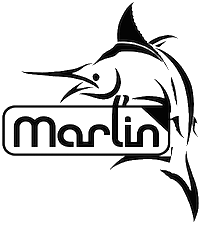

# Marlin Documentation Project

[](https://travis-ci.org/MarlinFirmware/MarlinDocumentation)

The aim of this project is to provide a clear and consise documentation of the [Marlin 3D printer firmware](https://github.com/MarlinFirmware/Marlin), we made it open and available on Github so anyone is welcome to contribute by either completing, correcting or creating new arcticles. Please see the chapter "[Most wanted contributions](#most-wanted-contributions)" for a list of the current most valuable needed contributions for the documenation project.



Be safe, have fun and build anything.

## Getting started

Marlin Documentation Project is built using the following technologies:
- [Ruby](https://www.ruby-lang.org/en/downloads/)
- [RubyGems](https://rubygems.org/pages/download)
- [Jekyll](https://jekyllrb.com/)
- [Github pages](https://pages.github.com/)

We really recommend reading one of the following tutorials for a quick start with Jekyll:
- [Jekyll running on Windows](http://jekyll-windows.juthilo.com/)
- [Jekyll running on Linux, Unix, or Mac OS X](https://jekyllrb.com/docs/installation/)


## Instaling buildroot on Windows

 1. Get Ruby for Windows ([32 bit](http://dl.bintray.com/oneclick/rubyinstaller/rubyinstaller-2.2.2.exe), [64bit](http://dl.bintray.com/oneclick/rubyinstaller/rubyinstaller-2.2.2-x64.exe)), execute the installer and go through the steps of the installation, make sure to check the “Add Ruby executables to your PATH” box.
 2. Get Ruby Devkit ([32 bit](http://dl.bintray.com/oneclick/rubyinstaller/DevKit-mingw64-32-4.7.2-20130224-1151-sfx.exe), [64bit](http://dl.bintray.com/oneclick/rubyinstaller/DevKit-mingw64-64-4.7.2-20130224-1432-sfx.exe)), the download is a self-extracting archive. When you execute the file, it’ll ask you for a destination for the files. Enter a path that has no spaces in it. We recommend something simple, like ` C:\RubyDevKit\` . Click Extract and wait until the process is finished.
 3. Open your favorite command line tool and do:
  - `cd C:\RubyDevKit`
  - `ruby dk.rb init`
  - `ruby dk.rb install`
  - `gem install bundler`

## Previewing content

You must clone localy a copy **your** MarlinDocumentation fork, to do this open a terminal/cmd window and do:
  - `cd C:\`
  - `git clone https://github.com/MarlinFirmware/MarlinDocumentation.git`

This will create locally a `C:\MarlinDocumentation`.

Jekyll allows you to preview the changes before submitted them to Github, just open a terminal/cmd window chdir to your local copy of the repository and execute the following commands:

```
bundle install --path vendor/bundle
bundle exec jekyll serve --watch
```

You only need to execute the `bundle install` once as it will make sure you have all the required dependencies installed.

Jekyll will watch the local files and on every save you do will trigger an automatic build of the site which can then be easly previewed from [your own computer](http://localhost:4000/).

## How to contribute

Let's pretend you want to add a new document to the project, you should start by forking the **MarlinDocumentation** repository. Then you should create a new branch, as the new document is about "mashed potatos" we do the following command:

```
git checkout -b doc-mashed_potatos
```

Then inside the `_docs` folder you should add the new file `mashed-potatos.md` and let flow all your creativity into it.
When you feel it is ready to be shared with the world just submit a commit into your own fork of **MarlinDocumentation** a start a new Pull Request to upstream.

```
git add mashed-potatos.md
git commit -m "Added a new document about potatos"
git push
```

## Coding style

The preferred format for new document contribution is Markdown language.

## Most wanted contributions

1. Transport all documents from old Marlin wiki into this new system.
2. Create getting started guides to ease the Marlin learning curve for new users.

## License

Marlin is published under the [GPL license](/LICENSE) because we believe in open development. The GPL comes with both rights and obligations. Whether you use Marlin firmware as the driver for your open or closed-source product, you must keep Marlin open, and you must provide your compatible Marlin source code to end users upon request. The most straightforward way to comply with the Marlin license is to make a fork of Marlin on Github, perform your modifications, and direct users to your modified fork.

While we can't prevent the use of this code in products (3D printers, CNC, etc.) that are closed source or crippled by a patent, we would prefer that you choose another firmware or, better yet, make your own.
